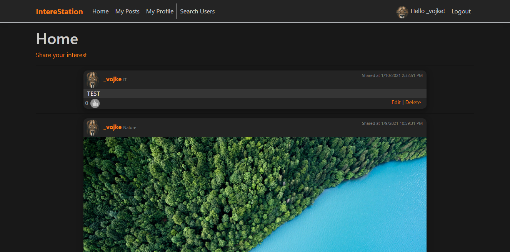
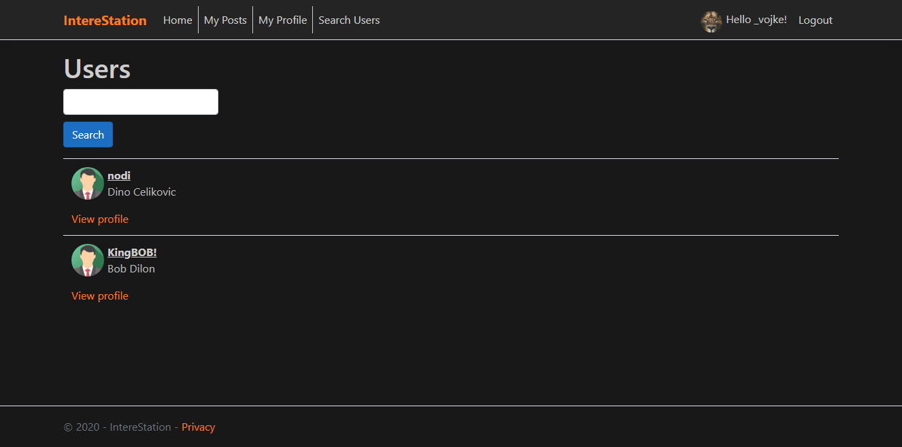
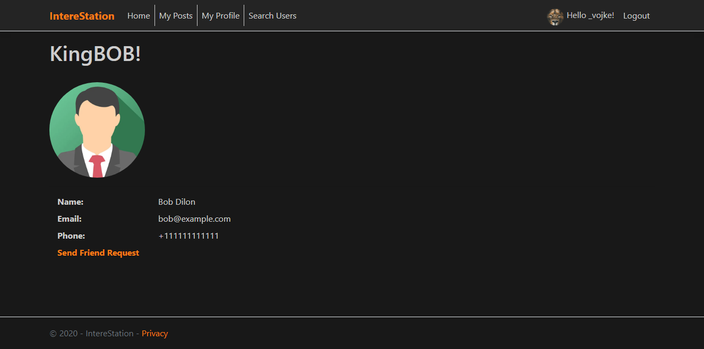
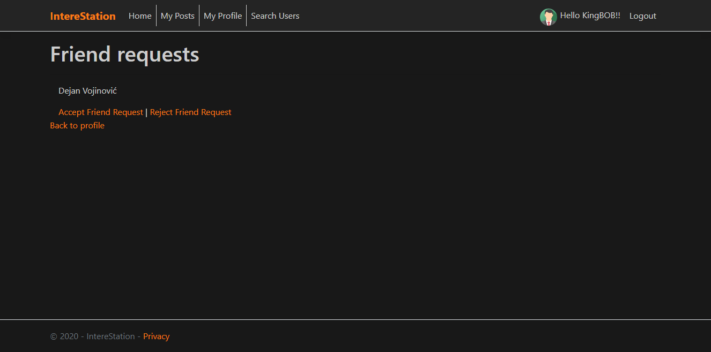
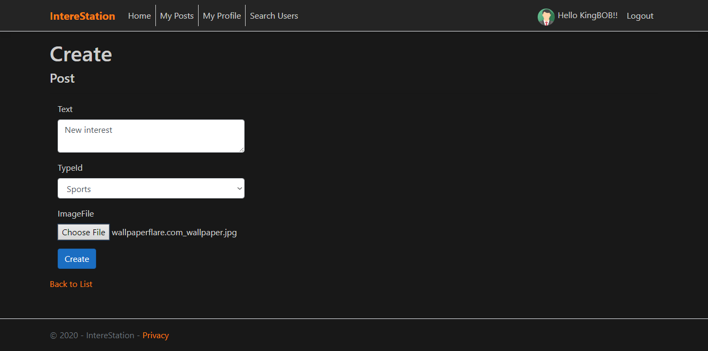

IntereStation

Člana ekipe:

63180387 Dejan Vojinovic
63180357 Dino Celikovic

Z informacijskim sistemom IntereStation smo naredili enostavno verzijo družbenega omrežja, v katerem registrirani uporabniki lahko objavljajo karkoli znotraj njihovega interesnega področja, in tudi lahko berejo objave ki so jih objavili drugi uporabniki ki so tudi v njihovem območju interesa. Družbeno omrežje je nekaj podobnega kot so danes Reddit in Pinterest oz. neki hibridni tip teh dveh omrežij. Sistem omogoča prijave uporabnikov kot tudi registracijo novih. Uporabniki imajo možnost izbire interesov, in s tem tudi objav ki se jim prikazujejo na glavni strani. Znotraj objave uporabnik lahko doda tako kot besedilo tudi fotografije. Za vsako objavo obstaja tudi rating sistem, kjer lahko ostali uporabniki ocenijo njeno vsebino.

Zaslonske slike grafičnega vmesnika:
    

Slika 1 Začetna stran
   

Slika 2 Iskanje uporabnikov
   

Slika 3 Profil iskanekga uporabnika
   

Slika 4 Profil trenutnega uporabnika
   

Slika 5 Prošnje za prijateljstvo
   

Slika 6 Delitev objav
